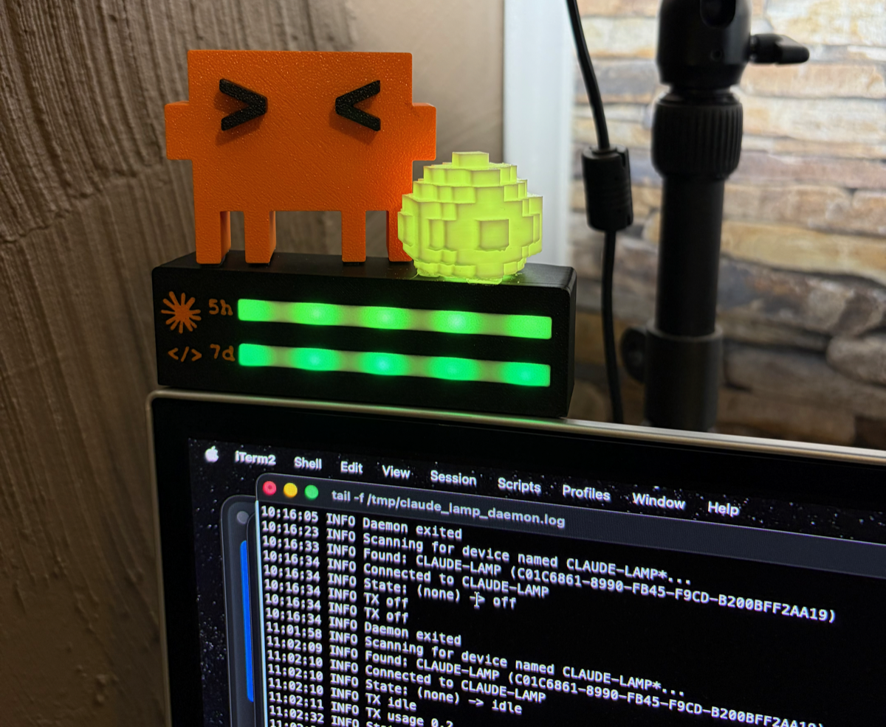

# ESP32 Claude Status Lamp (WS2812B)

A physical status indicator for [Claude Code](https://docs.anthropic.com/en/docs/claude-code),
built on an ESP32 DevKit and a WS2812B LED strip. Fork of
[bobek-balinek/claude-lamp](https://github.com/bobek-balinek/claude-lamp), with the
commercial Moonside lamp replaced by DIY hardware — animations are rendered on the ESP32,
and macOS only sends state words over BLE.



| State | Effect | Trigger |
|---|---|---|
| **Working** | Slow yellow-green pulse | Prompt submit, tool use |
| **Idle** | Solid warm amber | Claude finishes responding, session start |
| **Needs input** | Bright red pulse | Permission request, plan approval, question |
| **Off** | Dark | Session end |

The strip doubles as a token-budget display: LEDs 1–5 show the
**5-hour** window and LEDs 6–10 the **7-day** window as fuel gauges — at 0% usage all
5 LEDs glow green; the bar drains and shifts green→yellow→red as usage climbs (each
LED = 20% remaining; at ≥95% used a single red LED blinks). Status animations use
LED 0. See [Usage bars](#usage-bars).

## Quick start

```sh
git clone https://github.com/s3lehtin/esp32-claude-lamp.git
cd esp32-claude-lamp
./setup.sh
```

Wire the strip as in [Hardware](#hardware), plug the ESP32 in over USB, and run
`./setup.sh` — it checks the [prerequisites](#prerequisites), builds and flashes the
firmware, and installs the macOS side (hooks, daemon, venv). Then restart Claude Code.
The script is idempotent; re-run it any time. `./setup.sh --host-only` and
`--firmware-only` run just one half, `--no-flash` skips the upload step.

## Architecture

```
Claude Code hook event
  → claude_lamp_hook.sh (writes state to /tmp/claude_lamp_state, launches daemon if needed)
    → claude_lamp_daemon.py (persistent BLE connection, polls state file every 200ms)
      → ESP32 "CLAUDE-LAMP" via BLE (Nordic UART Service)
        → WS2812B strip (animations rendered in firmware)
```

## Hardware

- Classic ESP32 DevKit (ESP32-WROOM)
- WS2812B strip, short (~30 LEDs), powered from the board's 5V/VIN pin (USB)

### Wiring

| Strip wire | ESP32 pin |
|---|---|
| +5V | `VIN` / `5V` |
| GND | `GND` |
| DIN (data) | `GPIO 16` |

Notes:
- The ESP32 outputs 3.3V data; for short strips this is normally fine. If you see glitches,
  add a level shifter (74AHCT125) or a single "sacrificial" pixel powered at ~4.3V.
- Brightness is capped at 120/255 by default (`DEFAULT_BRIGHTNESS` in the sketch) to stay
  within USB power limits; the gauge LEDs render at 1/3 of that (`GAUGE_DIM_DIV`) so the
  status LED stands out. A 330Ω resistor in the data line and a 470µF cap across power
  are good practice but optional for short strips.

## Prerequisites

Everything runs on macOS (BLE via CoreBluetooth). Install up front:

- [Homebrew](https://brew.sh)
- `arduino-cli` — `brew install arduino-cli`
- Python 3.10+ — `brew install python` (macOS's bundled 3.9 is too old)
- [Claude Code](https://docs.anthropic.com/en/docs/claude-code)

`./setup.sh` verifies all of the above (and tells you exactly what to install if
something is missing), then configures the rest itself: the ESP32 board-manager URL, the
`esp32:esp32` core, and the Adafruit NeoPixel / NimBLE-Arduino libraries. The manual
equivalent:

```sh
arduino-cli config init
arduino-cli config add board_manager.additional_urls https://espressif.github.io/arduino-esp32/package_esp32_index.json
make setup
```

## Firmware

Configuration constants at the top of [`firmware/claude_lamp/claude_lamp.ino`](firmware/claude_lamp/claude_lamp.ino):
`LED_PIN` (16), `LED_COUNT` (30), `DEFAULT_BRIGHTNESS` (80), `DEVICE_NAME` (`CLAUDE-LAMP`).

### Build & flash

`./setup.sh` does all of this on first run. For manual builds and iteration:

```sh
make setup     # one-time: install ESP32 core + libraries
make compile
make upload    # auto-detects /dev/cu.usbserial-*, or: make upload PORT=/dev/cu.usbserial-0001
make monitor   # serial console at 115200 baud
```

On boot the strip runs a quick amber wipe (self-test), then stays dark and advertises as
`CLAUDE-LAMP`.

### BLE protocol

Nordic UART Service (`6e400001-…`), ASCII commands written to the RX characteristic
(`6e400002-…`):

| Command | Effect |
|---|---|
| `working` / `idle` / `input` / `off` | The four states |
| `color R,G,B` | Solid custom color, e.g. `color 255,0,128` |
| `bright N` | Brightness cap 0–255, e.g. `bright 120` |
| `usage P7,P5` | Usage gauges: 7-day used-% on LEDs 6–10, 5-hour used-% on LEDs 1–5 (0–100 each), e.g. `usage 73,12` |
| `usage -` | Clear both usage gauges (unknown → dark) |

Status commands paint LED 0 only; the usage gauges persist across every state except
`off`. The command carries *used* percent, but the bar renders what *remains*: full green
at 0% used, draining toward red, and a single red LED blinking at ~1 Hz from 95% used —
so a fully dark gauge always means "no data", never "limit reached".

## macOS setup

```sh
./setup.sh --host-only   # firmware already flashed? this installs just the macOS side
```

The script copies the hook + daemon to `~/.claude/claude_lamp_hooks/`, creates a venv
there with [bleak](https://github.com/hbldh/bleak), and merges the hook entries into
`~/.claude/settings.json` (the old file is backed up first; re-running is safe and
updates the entries in place). Then restart Claude Code — the daemon auto-discovers the
lamp by name. First connection takes a few seconds; tail
`/tmp/claude_lamp_daemon.log` to watch it.

<details>
<summary>Manual steps (what the script does)</summary>

### 1. Copy scripts

```sh
mkdir -p ~/.claude/claude_lamp_hooks
cp claude_hooks/claude_lamp_hook.sh claude_hooks/claude_lamp_daemon.py ~/.claude/claude_lamp_hooks/
chmod +x ~/.claude/claude_lamp_hooks/claude_lamp_hook.sh
```

### 2. Create the venv

The hook looks for a `venv/` next to itself first (then falls back to `python3`,
`/opt/homebrew/bin/python3`, `$CONDA_PREFIX`):

```sh
python3 -m venv ~/.claude/claude_lamp_hooks/venv   # needs python 3.10+
~/.claude/claude_lamp_hooks/venv/bin/pip install bleak
```

### 3. Install the hooks

Merge the hook entries from `claude_hooks/settings.json` into `~/.claude/settings.json`,
replacing `$CLAUDE_PROJECT_DIR/claude_hooks` with the absolute hooks path. This prints
the substituted config — merging it into your settings file is up to you. Use `$HOME`,
not `~`: tilde doesn't expand inside the double-quoted command strings.

```sh
sed "s|\$CLAUDE_PROJECT_DIR/claude_hooks|$HOME/.claude/claude_lamp_hooks|g" claude_hooks/settings.json
```

### 4. Restart Claude Code

Open a new session — the daemon auto-discovers the lamp by name.

</details>

### Hook event mapping

| Event | State |
|---|---|
| `SessionStart`, `Stop`, `Notification: idle_prompt` | idle |
| `UserPromptSubmit`, `PreToolUse` (work tools), `PostToolUse` (any tool) | working |
| `PreToolUse: AskUserQuestion/ExitPlanMode`, `PermissionRequest`, `Notification: permission_prompt` | input |
| `SessionEnd` | off |

`PostToolUse → working` makes the lamp return to the working pulse after you approve a
permission or answer a question. Known limitation: there is no "permission granted" hook
event, so during a single *long-running* approved command the lamp stays red until that
command completes; multi-step turns self-correct on the next tool call.

## Usage bars

The daemon polls your Claude token utilization every 3 minutes and mirrors it to
LEDs 1–10 as remaining-budget fuel gauges — the same numbers `/usage` shows in
Claude Code:

- **Data source:** the Claude Code OAuth token is read from the macOS Keychain item
  `Claude Code-credentials` and used against `https://api.anthropic.com/api/oauth/usage`.
  ⚠️ This is an **unofficial, undocumented endpoint** — it may change or disappear at any
  time. If it breaks, the bars simply go dark; everything else keeps working.
- **Keychain prompt:** the first fetch may pop a macOS dialog asking to allow access to
  `Claude Code-credentials` — click **Always Allow** (the daemon runs headless; until you
  do, fetches fail quietly and the bars stay dark). The token never leaves the machine
  except to Anthropic's API, and is never logged.
- **Refresh & failure behavior:** first fetch happens immediately on daemon start, then
  every 180 s (always re-sent, so the bars self-heal after an ESP32 reboot). On hard
  fetch errors the last value is kept; after 3 consecutive failures the bars are cleared
  rather than showing stale data. HTTP 429 (the endpoint does rate-limit) never clears
  the bars — the daemon just backs off exponentially, up to 30 min. Successful results
  are cached in `/tmp/claude_lamp_usage_cache.json` for 5 minutes, so the API sees at
  most one query per 5 min even across daemon restarts.
- **Standalone test:** `~/.claude/claude_lamp_hooks/venv/bin/python3
  ~/.claude/claude_lamp_hooks/claude_lamp_daemon.py --once` prints the fetched
  `(7d, 5h)` percentages (or `None` on failure) without touching BLE.

After updating the daemon script, redeploy with `./setup.sh --host-only` (it also stops
the running daemon so the next hook event picks up the new code), or manually:

```sh
cp claude_hooks/claude_lamp_daemon.py ~/.claude/claude_lamp_hooks/
kill "$(cat /tmp/claude_lamp_daemon.pid 2>/dev/null)" 2>/dev/null
rm -f /tmp/claude_lamp_daemon.pid   # next hook event respawns the new daemon
```

## Daemon lifecycle

| File | Purpose |
|---|---|
| `/tmp/claude_lamp_daemon.pid` | Daemon PID |
| `/tmp/claude_lamp_state` | Current desired state |
| `/tmp/claude_lamp_daemon.log` | Daemon log |

The daemon keeps a persistent BLE connection (avoids 2–5s reconnects per hook event) and
auto-exits after 30 minutes idle or on `SessionEnd`.

## Smoke test without Claude Code

```sh
# use a python that has bleak, e.g. the hook venv:
~/.claude/claude_lamp_hooks/venv/bin/python3 - <<'EOF'
import asyncio
from bleak import BleakClient, BleakScanner

RX = "6e400002-b5a3-f393-e0a9-e50e24dcca9e"

async def main():
    dev = next(d for d in await BleakScanner.discover(timeout=10)
               if (d.name or "").startswith("CLAUDE-LAMP"))
    async with BleakClient(dev) as c:
        for state in ("working", "input", "idle", "off"):
            print("->", state)
            await c.write_gatt_char(RX, state.encode(), response=True)
            await asyncio.sleep(4)

asyncio.run(main())
EOF
```

## Troubleshooting

**Lamp not responding:**
```sh
cat /tmp/claude_lamp_daemon.log
```

**Daemon stuck:**
```sh
kill "$(cat /tmp/claude_lamp_daemon.pid)"
rm -f /tmp/claude_lamp_daemon.pid /tmp/claude_lamp_state
```

**bleak not found:** the hook tries `venv/` next to itself first, then `python3`,
`/opt/homebrew/bin/python3`, and `$CONDA_PREFIX/bin/python3` — make sure one of them
has bleak installed.

**`arduino-cli: command not found` / `Platform 'esp32:esp32' not found`:** see
[Prerequisites](#prerequisites) — install `arduino-cli` with Homebrew, then let
`./setup.sh` (or `make setup`) add the board-manager URL and core.

**No serial port found:** use a USB *data* cable (many are charge-only) and check the
board shows up as `/dev/cu.usbserial-*` / `/dev/cu.SLAB_USBtoUART` / `/dev/cu.wchusbserial*`.
If it appears under another name, pass it explicitly: `make upload PORT=/dev/cu.…`.

**Flashing fails ("Invalid head of packet" / serial corruption):** don't flash through a
USB hub or dock — plug the board directly into the Mac. The CP2102 serial stream corrupts
behind hubs, which looks like a boot-mode problem but isn't.

## Acknowledgments

- [bobek-balinek/claude-lamp](https://github.com/bobek-balinek/claude-lamp) — the original
  project this is forked from; the hook → state file → BLE daemon architecture and the
  Claude Code hooks configuration come from there. A local clone lives in `fork/`
  (git-ignored, reference only).

## License

MIT, same as the original [claude-lamp](https://github.com/bobek-balinek/claude-lamp/blob/main/LICENSE).
